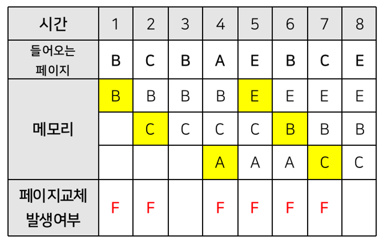

# 페이지 교체 - 선입선출 알고리즘
페이지 교체 알고리즘은 메모리를 관리하는 운영체제에서, 페이지 부재가 발생하여 새로운 페이지를 할당하기 위해 현재 **할당된 페이지 중 어느 것을 교체할지를 결정하는 방법**입니다.
이 알고리즘이 사용되는 시기는 페이지 부재(Page Fault)가 발생해 새로운 페이지를 적재해야 하지만 페이지를 적재할 공간이 없어 이미 적재되어 있는 페이지 중 교체할 페이지를 정할 때 사용됩니다.
빈 페이지가 없는 상황에서 메모리에 적재된 페이지와 적재할 페이지를 교체함으로 페이지 부재 문제를 해결할 수 있습니다.
[(wikipedia)](https://ko.wikipedia.org/wiki/%ED%8E%98%EC%9D%B4%EC%A7%80_%EA%B5%90%EC%B2%B4_%EC%95%8C%EA%B3%A0%EB%A6%AC%EC%A6%98)

이 중 선입선출(FIFO) 알고리즘은 가장 먼저 들어와서 가장 오래있었던 페이지를 우선으로 교체시키는 방법을 의미합니다. 아래의 그림을 참고해주세요.

메모리의 크기가 i로 주어지고 들어올 페이지들이 n으로 주어졌을 때, 전체 실행시간을 구해주세요.

만약 스택 안에 같은 스케줄이 있다면 hit 이라고 하며 실행시간은 1초 입니다. 스택 안에 스케줄이 없다면 miss 라고 하며 실행시간은 6초 입니다.

| 스케줄 | 페이지 프레임 | 실행시간 |
|:---:|:---:|:---:|
| BCBAEBCE | 3 | 38 |
| ABCABCABC | 3 | 24 |
| ABCDABEABCDE | 4 | 62 |
| ABCEDF | 0 | 36 |
| ABCDABEA | 3 | 43 |

- 예제 1번을 보면 페이지 프레임의 개수는 3개이고 스케줄은 'BCBAEBCE' 입니다. 
  6번의 miss를 기록하므로 **6번 * 6초 = 36초**가 되고  2번의 hit을 기록하므로 **2번 * 1초 = 2초**입니다. 
  2개를 합한 값이 실행시간이므로, 38초가 됩니다.