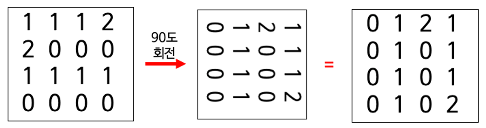
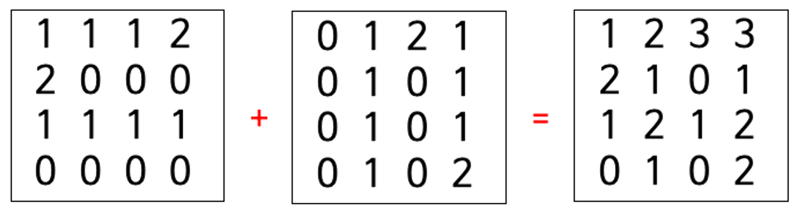

# 도장찍기
빈 종이에 stamp 모양으로 생긴 도장을 `90 * k` 도로 회전하며 찍습니다. 

도장은 N*N 크기이며 각 도장이 찍히는 부분은 1 이상의 자연수와 도장이 찍히지 않는 부분은 0으로 이루어져 있습니다.

도장의 크기 N과,
종이에 찍힌 도장 횟수를 표현한 stmp 배열과,
얼마만큼 회전할 것인지를 알려주는 회전수 k를 입력받았을 때 각 위치에서 몇 번 도장이 찍혔는지 그 결과값을 출력하세요.




```
입력

도장 = [
[1,1,1,2],
[2,0,0,0],
[1,1,1,1],
[0,0,0,0]]

회전 = 1


출력

[[1, 2, 3, 3], [2, 1, 0, 1], [1, 2, 1, 2], [0, 1, 0, 2]]
```